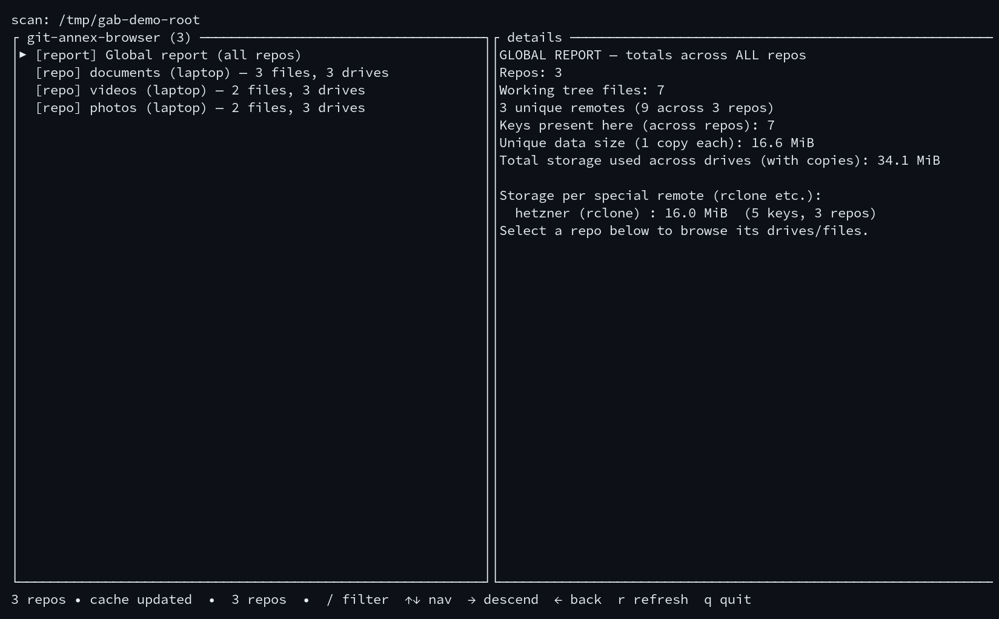
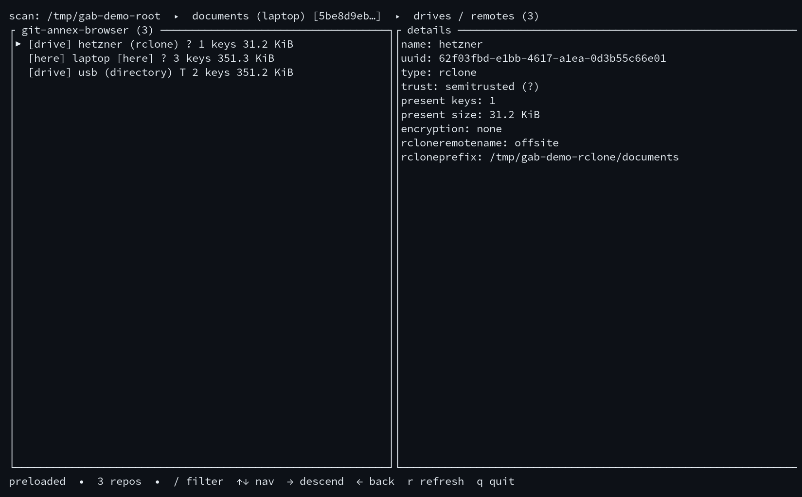
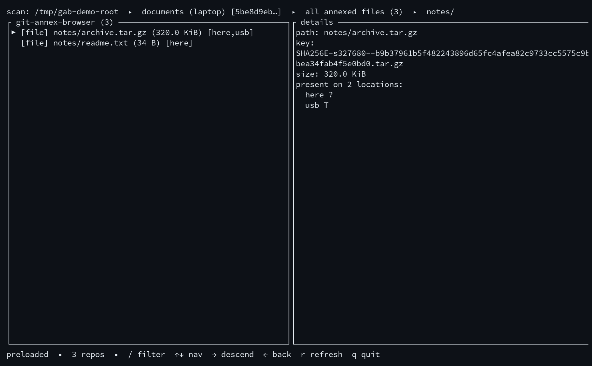

# git-annex-browser

[](LICENSE)







A [Crossterm](https://github.com/crossterm-rs/crossterm) +
[Ratatui](https://ratatui.rs) terminal UI for exploring git-annex repositories.

All this information is available via normal `git annex` commands, but querying it repeatedly across many repositories and drives (especially when many of them are offline) is slow and cumbersome. The tool caches the data (using `--scan`) so you can explore the complete current state quickly and clearly through an interactive interface.

**Binary name:** `git-annex-browser`

Metadata is read from the git-annex branch logs (`uuid.log`, `trust.log`, `group.log`, and so on) plus `git annex whereis --json --all` / `git annex find`. The TUI itself is view-only.

## Features
- Recursive discovery of annex repos under the given root (skips `.git` object stores; follows `gitdir:` worktrees).
- Per-repo view of:
  - Summary (uuid, counts, trust breakdown, last fsck)
  - **Drives / remotes** list with type, trust (`T`/`?`/`U`/`D`, colored), present key counts, last fsck
  - Files present on a specific drive (including here), from cached location data so offline drives stay browsable
  - All annexed files in the working tree, each annotated with short presence badges
- For each file: locations (trusted and untrusted copies) + key + size
- The TUI shows the cache immediately, then re-scans every annex in the background and refreshes the view (and cache) as each repo finishes
- Global report includes unique vs total-with-copies size, plus storage per special remote (rclone etc.; other annex clones are omitted)
- Keyboard-driven tree navigation like zfs-browser
- `/` filters the current list

## Usage
```
git-annex-browser [OPTIONS] [DIR]
```

`DIR` defaults to `.` (current directory). Only annexes under that directory are shown; the on-disk cache still keeps repos from other roots.

| Flag | Meaning |
|---|---|
| `--scan` | Discover annexes under `DIR`, load metadata, merge into the cache, then exit (no TUI). Useful from cron. |
| `--quiet` | With `--scan`, suppress progress. |
| `--dump` | Print a text summary (no TUI) and merge the result into the cache. |
| `--tick-ms <N>` | UI poll interval in milliseconds (clamped 10–1000, default 100). |

`--scan` and `--dump` **merge** into the cache: repos under `DIR` are updated or removed if they disappeared; cached repos outside `DIR` are left alone.

Descend into a repo → drives → files on that drive. `r` / `F5` re-scans from disk.

Keys:
```
↑ / k          up
↓ / j          down
PgUp / PgDn    page list
Shift+PgUp/Dn  scroll details pane
g / G          top / bottom
→ / Enter / l  descend
← / h / Back   back
/              filter current list (Enter to keep, Esc to clear)
r / F5         refresh / re-scan
x              toggle raw view (locations / logs for selection)
? / F1         help
q / Esc        quit
```

## Cache

Default path: `$XDG_CACHE_HOME/git-annex-browser/cache.json`, or `~/.cache/git-annex-browser/cache.json`.

Override with `GIT_ANNEX_BROWSER_CACHE`. The file is compact JSON, mode `0600`, written under a lock. Special-remote `cipher` values are redacted.

## Requirements
- git + git-annex installed
- A Rust toolchain (for building from source). Edition 2024, so a recent stable rustc.

## Installation

### From source

```sh
git clone https://github.com/janttsu/git-annex-browser.git
cd git-annex-browser
cargo build --release
./target/release/git-annex-browser /path/with/annexes
```

You can install it with:

```sh
cargo install --path .
```

Then run:

```sh
git-annex-browser /path/with/annexes
```

Cron-style cache refresh:

```sh
git-annex-browser --scan --quiet /path/with/annexes
```

## Notes
- View only: no `git annex get` / `drop` / `trust`.
- Nested annexes inside another annex working tree are not discovered (the parent annex is a prune point).
- Very large annexes (>50k files) still materialize the file tree when you open "all files" or a drive's file list; prefer drive-specific views and `/` filter.
- Drive file lists use cached `whereis` data, not a live `git annex list`.

## Future Ideas
- Opt-in write support (`git annex trust`, copy hints).
- Coverage %, risk files (present only on untrusted), global dedup view across multiple repos.

Licensed under MIT OR Apache-2.0. See [LICENSE](LICENSE) and [LICENSE-APACHE](LICENSE-APACHE).
