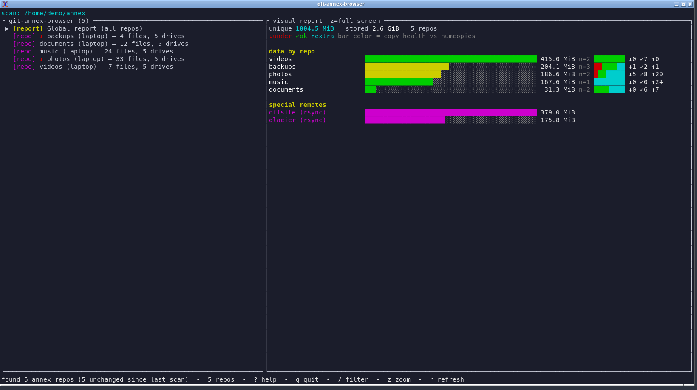
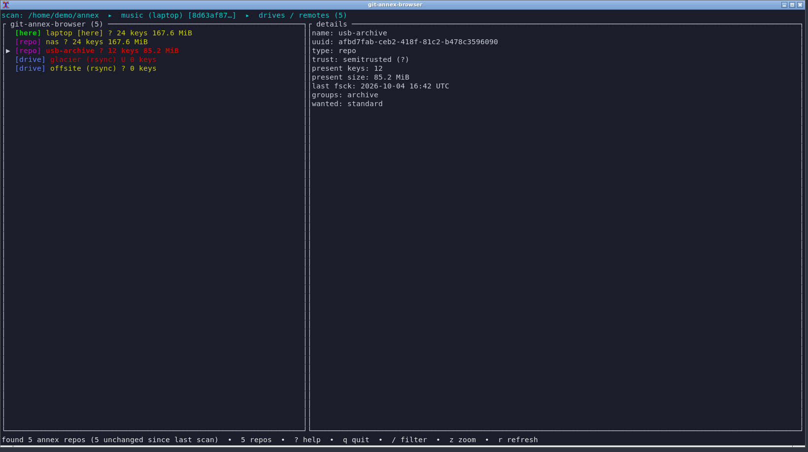
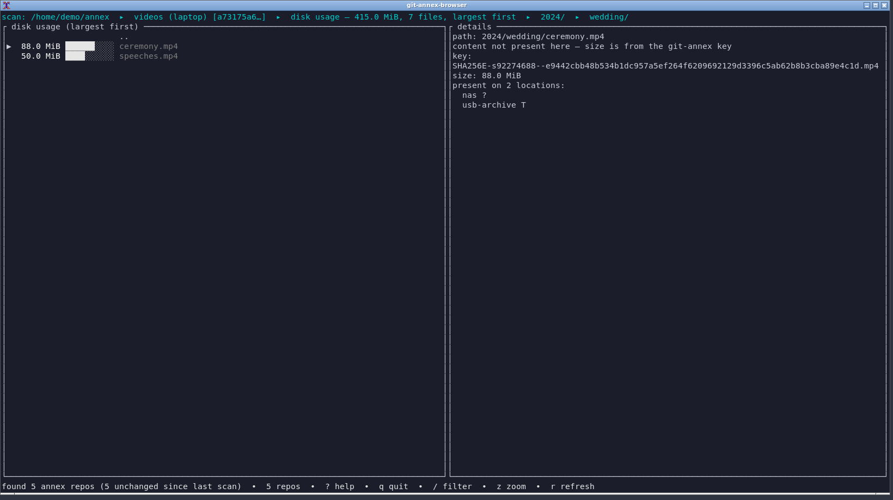
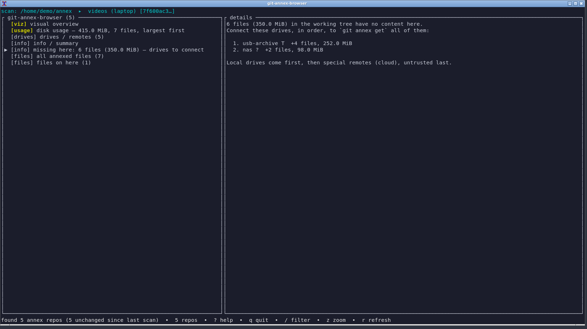
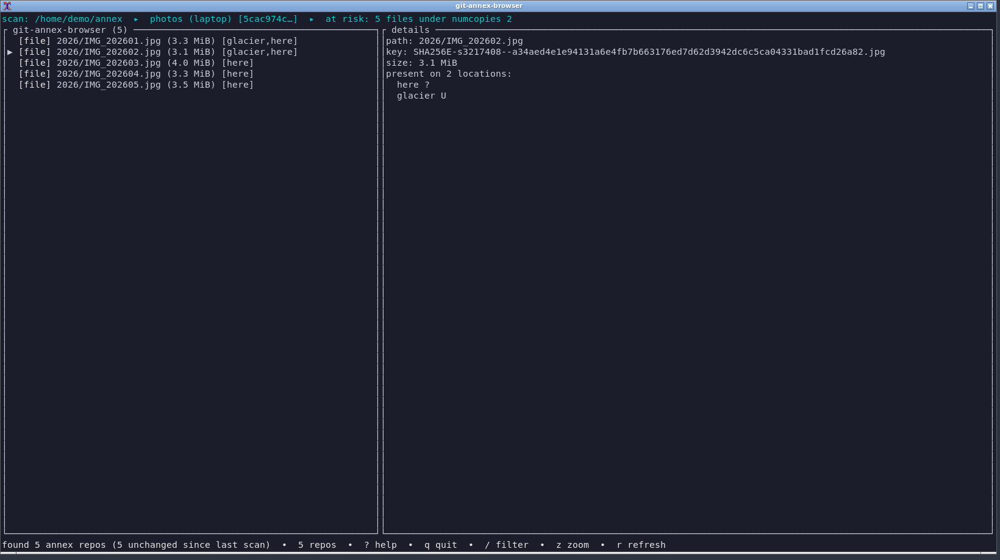

# git-annex-browser

[](LICENSE)











A [Crossterm](https://github.com/crossterm-rs/crossterm) +
[Ratatui](https://ratatui.rs) terminal UI for exploring git-annex repositories.

All this information is available via normal `git annex` commands, but querying it repeatedly across many repositories and drives (especially when many of them are offline) is slow and cumbersome. The tool caches the data (using `--scan`) so you can explore the complete current state quickly and clearly through an interactive interface.

**Binary name:** `git-annex-browser`

Metadata is read from the git-annex branch logs (`uuid.log`, `trust.log`, `group.log`, per-key location logs, and so on) plus `git annex find --branch HEAD --anything`. File sizes come from annex keys (`bytesize`), not the filesystem, so dropped or missing working-tree files still appear. Location logs include untrusted remotes (e.g. Glacier), so used-storage figures update after `git annex copy --to` without a slow `whereis --all`. The TUI itself is view-only.

## Features
- Recursive discovery of annex repos under the given root (skips `.git` object stores; follows `gitdir:` worktrees). Refs are read from disk, so plain git repos cost no extra process.
- Per-repo view of:
  - Summary (uuid, counts, trust breakdown, last fsck)
  - **Drives / remotes** list with type, trust (`T`/`?`/`U`, colored), present key counts, last fsck. Remotes marked `git annex dead` are omitted.
  - Files present on a specific drive (including here), from cached location data so offline drives stay browsable
  - All annexed files in the working tree, each annotated with short presence badges
  - **Disk usage** (ncdu-style): directories and files sorted largest-first, with size bars. Sizes are from git-annex keys, so this works when content is not present here
  - **At risk**: working-tree files with fewer counting copies than numcopies (untrusted copies such as Glacier do not count), fewest copies first
  - **Missing here**: how many files have no content in this clone, and which drives to connect, in order, to `git annex get` them all (local drives first, then special remotes, untrusted last)
- For each file: locations (trusted and untrusted copies) + key + size
- The TUI shows the cache immediately. Discovery, cache reads, repo loads and cache writes run in the background, so navigation never waits on disk.
- Only repos whose git-annex branch, `HEAD` or config changed since the last scan are reloaded. `r` reloads everything.
- Cached repos that a scan no longer finds (unplugged drive) stay listed and browsable, marked "not found since …".
- Global report includes unique vs total-with-copies size, plus storage per special remote (rclone etc.; other annex clones are omitted)
- Live visual report: per-repo size bars and copy-health colour (red=under numcopies, yellow=mixed, green=ok). Repos with keys under numcopies get a `↓` in the list. `z` (or Enter on the report) zooms to full screen.
- Keyboard and mouse navigation like zfs-browser; `/` filters the current list; `s` sorts repos by name, size, copy health or file count

## Usage
```
git-annex-browser [OPTIONS] [DIR]
```

`DIR` defaults to `.` (current directory). Only annexes under that directory are shown; the on-disk cache still keeps repos from other roots.

| Flag | Meaning |
|---|---|
| `--scan` | Discover annexes under `DIR`, reload new or changed ones into the cache, then exit (no TUI). Useful from cron. Exits non-zero if a repo could not be loaded. |
| `--dump` | Like `--scan`, then print a text summary of every repo. |
| `--json` | With `--dump`, print JSON (totals, special remotes, repos with their remotes). |
| `--quiet` | Suppress progress output. |
| `--offline` | TUI from the cache only; do not touch the repos. |
| `--force-rescan` | Reload every repo even if unchanged. |
| `--prune` | With `--scan`/`--dump`, delete cached repos under `DIR` that were not found (default: keep them as "not found"). |
| `--jobs <N>` | Repos to load in parallel (default: CPU count, at most 4). |
| `--max-depth <N>` | Limit how deep discovery walks below `DIR`. |
| `--one-file-system` | Do not cross into other mounts while discovering. |
| `--cache <DIR>` | Cache directory (see below). |
| `--tick-ms <N>` | UI poll interval in milliseconds (clamped 10–1000, default 100). |

Descend into a repo → disk usage (largest dirs/files), at-risk files, missing-here plan, or drives → files on that drive.

Keys:
```
↑ / k          up
↓ / j          down
PgUp / PgDn    page list
g / G          top / bottom (also Home / End)
→ / Enter / l  descend
← / h / Back   back
Esc            close zoom / filter, else back (never quits)
Shift+PgUp/Dn  scroll details pane (also J / K, Ctrl+d / Ctrl+u)
/              filter current list (Enter to keep, Esc to clear)
s              sort repos: name → size → copy health → file count
r / F5         refresh: re-discover and reload every repo
x              raw view (file locations; tab-separated listing in disk usage)
z              zoom the visual to full screen
? / F1         help (any key closes it)
q              quit
mouse          wheel scrolls; click selects; click the selected row to open it
```

## Cache

Default directory: `$XDG_CACHE_HOME/git-annex-browser`, or `~/.cache/git-annex-browser`. Override with `--cache DIR` or `GIT_ANNEX_BROWSER_CACHE`.

```
v2/index.json         summaries, fingerprints, "not found since" markers
v2/repos/<hash>.json  full metadata for one repo
```

Saving a repo rewrites only its own file and the index. Files are written atomically with mode `0600` (directories `0700`) under a lock, so a cron `--scan` and an open TUI can share the cache. Special-remote secrets (`cipher`, `embedcreds`, …) are redacted.

The single-file `cache.json` from earlier versions is imported on first start and then no longer used; delete it when you like. If `GIT_ANNEX_BROWSER_CACHE` points to an old `cache.json`, its directory is used and the file is imported.

## Requirements
- git + git-annex installed
- Rust 1.89 or newer (for building from source).

## Installation

### From source

```sh
git clone https://github.com/janttsu/git-annex-browser.git
cd git-annex-browser
cargo build --release
./target/release/git-annex-browser /path/with/annexes
```

You can install it with:

```sh
cargo install --path .
```

Then run:

```sh
git-annex-browser /path/with/annexes
```

Cron-style cache refresh (unchanged repos are skipped, so this is cheap):

```sh
git-annex-browser --scan --quiet /path/with/annexes
```

Machine-readable report:

```sh
git-annex-browser --dump --json --quiet /path/with/annexes | jq '.repos[] | {name, keys_under_numcopies}'
```

### Prebuilt binaries

Tagged releases (`v*`) attach Linux and macOS binaries with SHA-256 checksums to the GitHub release.

## Screenshots

The images above are real screens from a throwaway Arch Linux VM, not mock-ups. `scripts/screenshots/run.sh` boots the VM with qemu/KVM, builds this repository's committed source inside it, and creates a demo collection with ordinary git-annex commands (`scripts/screenshots/demo-data.sh`). It then drives the TUI in xterm and saves the VM's display with qemu's `screendump`.

```sh
scripts/screenshots/run.sh            # writes assets/*-view.png
```

It needs `qemu-system-x86_64` with KVM, `qemu-img`, `xorriso`, `ssh` and `python3`. The Arch cloud image is cached in `~/.cache/git-annex-browser-vm/` and checked against the official SHA-256. Set `IMAGE_URL` or `PACMAN_MIRROR` to use a faster mirror.

## Notes
- View only: no `git annex get` / `drop` / `trust`.
- Nested annexes inside another annex working tree are not discovered (the parent annex is a prune point).
- Very large annexes (>50k files) build the file tree when you first open "disk usage", "all files", or a drive's file list; it is kept while the repo stays open.
- Disk usage counts each path's annex size (like ncdu apparent size). Content does not need to exist on this clone.
- Drive file lists use cached location-log data, not a live `git annex list`.
- Remotes marked `git annex dead` are dropped from metadata: they do not appear in drive lists, file locations, visual bars, or used-storage totals (stale location-log rows would otherwise keep retired clones visible).

## Future Ideas
- Opt-in write support (`git annex trust`, copy hints).
- Global dedup view across multiple repos.

Licensed under MIT OR Apache-2.0. See [LICENSE](LICENSE) and [LICENSE-APACHE](LICENSE-APACHE).
